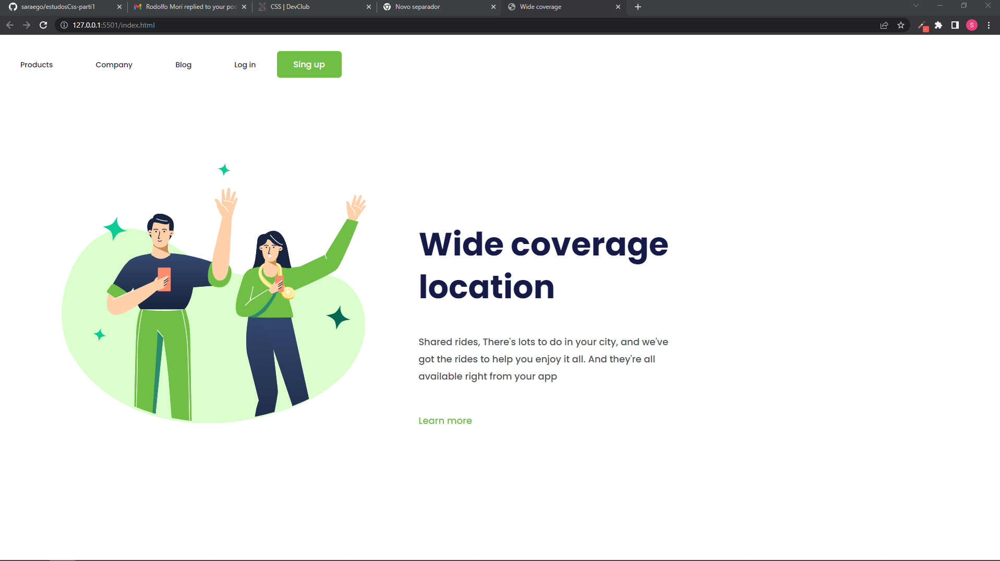

# estudosCss-parti2
Estudos

# Criançao de minPage basico para praticar

> Concluido estudo com resposividade e css.

Criando uma minipag com objetvo de praticar:

- [x] Criação do HTML
- [x] Criação do CSS
- [x] resposivo

